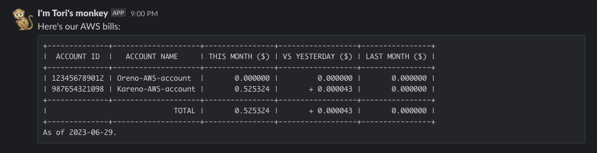

# aws-bills-on-slack
A monkey increases your visibility on AWS bills via Slack 🐒

## Prerequisites

- `aws-bills-on-slack` uses [`toricls/acos`](https://github.com/toricls/acos) as its dependency so you need to follow the [`toricls/acos`'s prerequisites](https://github.com/toricls/acos/blob/main/README.md#prerequisites) to run.
- Slack Incoming Webhook

## Installation

`aws-bills-on-slack` is built to run on AWS Lambda on a daily basis.

### Install using AWS SAM (tested and recommended)

Todo

### Install using CloudFormation

Todo

### Install using Terraform

Todo

## Contribution

1. Fork ([https://github.com/toricls/aws-bills-on-slack/fork](https://github.com/toricls/aws-bills-on-slack/fork))
4. Create a feature branch
5. Commit your changes
6. Rebase your local changes against the main branch
7. Create a new Pull Request (use [conventional commits] for the title please)

[conventional commits]: https://www.conventionalcommits.org/en/v1.0.0/

## Licence

Distributed under the [Apache-2.0](./LICENSE) license.

## Author

[Tori](https://github.com/toricls)
